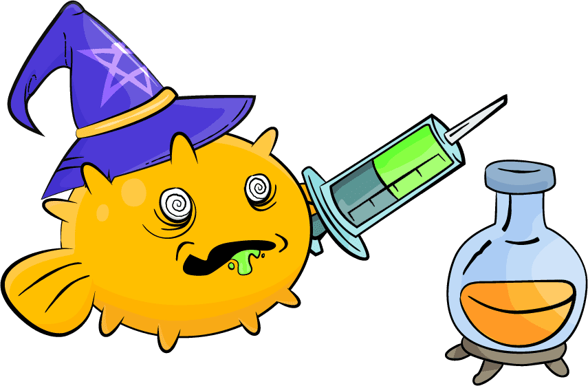

# CryptoPuffs

CryptoPuffs 是可收藏的河豚 NFT，可以通过锁定 BlowFish 代币或流动性来获得。 CryptoPuffs 有数以万计的变体。某些特征和颜色比其他的要少得多。如果你真的很幸运，你可能会发现鲨鱼或鲸鱼！

组建 Puff 团队进行远征以收集 NFT 奖励。你的团队构成会影响你的成功率！与 NPC Puff 团队战斗以赢得可装备的 NFT，或在下注时与其他玩家战斗。

CryptoPuffs 是在币安智能链上铸造的 ERC-721 代币。泡芙可以在我们自己的市场或任何支持 ERC721 的 BSC 平台上拍卖。

CryptoPuffs 是 BlowFish ($BLOWF) 平台的一部分。

