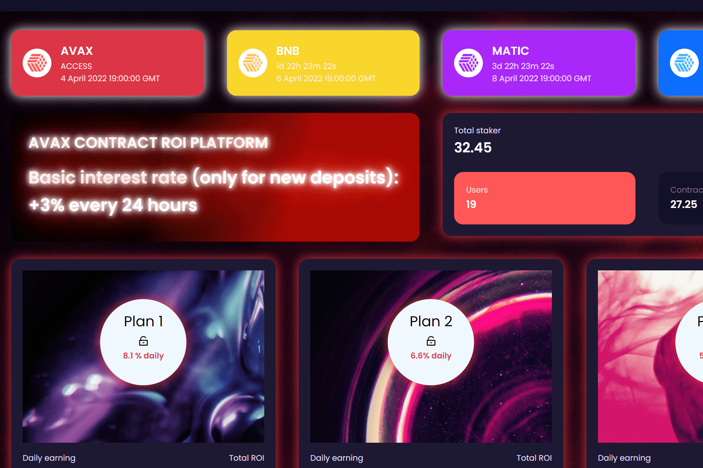

# Cryptopump

什么是加密泵？
特征
Cryptopump 是为 Avalanche 社区开发的高收益投资计划。该合约旨在奖励社区，尤其是在加密空间正经历剧烈市场波动的时候。
这是将您的 AVAX、MATIC、BNB、FTM 投入收益回报并获得良好投资回报率的最佳时机。这是一个社区驱动的项目。我们鼓励社区的每个成员将其收益的一小部分进行再投资，以维持合约的生命周期。
这个 Defi 投资方案是非常安全的，合约已经过审计验证是 100% 安全的。包含这些功能后，合约将能够维持很长时间。
安全可靠的协议——由 Haze Crypto 审核

