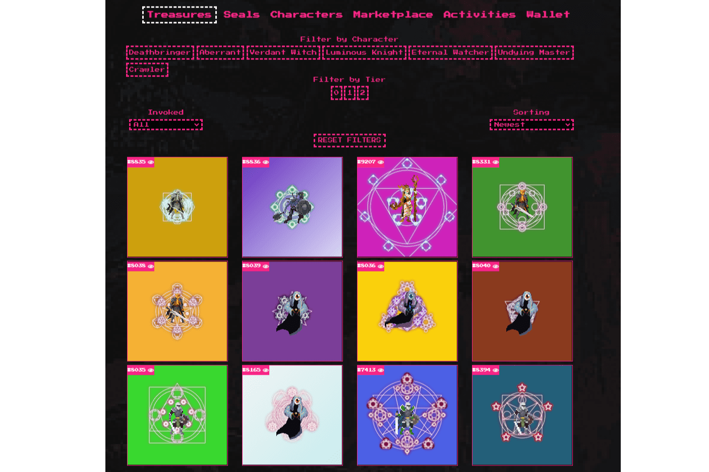

# CryptoSeals

CRYPTOSEAL 是 ERC721 不可替代的代币。将仅提供 9999 个密封件。每个印章均由计算机生成并具有自己的属性。密封件和属性存储在 IPFS + ARWEAVE 上。密封件有不同的类型，每一种都代表一个具有隐藏属性的字符，直到您调用密封件。每个角色都有 3 个不同的稀有度等级，如果没有调用印章，您将看不到这些等级。因此，您可以选择是要召唤您的生物还是保留它以供将来使用（您不知道它里面有什么！）。当你调用印章时，你的印章代表的生物将被召唤并可见，否则生物属性将被隐藏且不显示。

