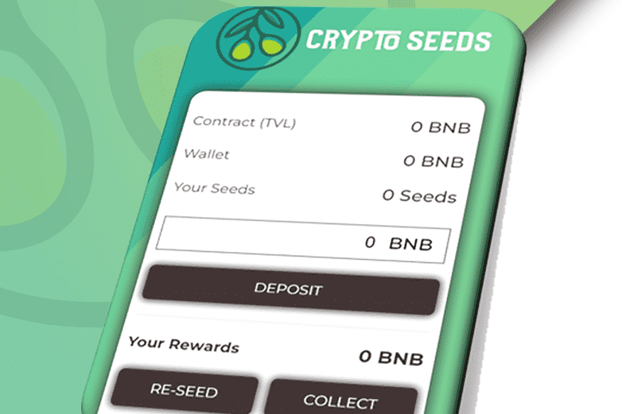

# CryptoSeeds Finance

CryptoSeeds Finance 是一种锁定质押奖励协议，又名 Crypto Miner。它依赖于一个简单而强大的智能合约，作为奖励池及其资金的管理者。

用户可以完全根据自己的财务策略选择存入、重新种子（复合）或收集（提取）资金。我们的智能合约仅充当所有用户操作的协调者。

此外，CryptoSeeds 自动使其所有成员能够利用其内置的推荐计划，这为积极帮助项目发展和曝光提供了独特的经济回报机会。

