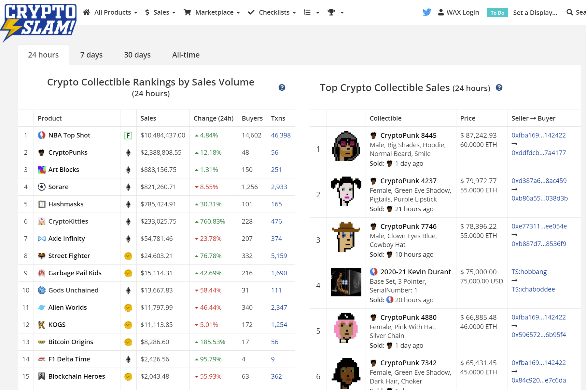

# CryptoSlam

一个基于 WAX 区块链的 NFT 填充市场，尽最大努力组织数以百万计的区块链收藏品。

CryptoSlam 旨在为跨多个区块链的数百万 NFT 收藏品提供终极透明度。作为值得信赖的 NFT 数据聚合器，买卖双方依靠 CryptoSlam 的数据来做出购买和销售决策。此外，NFT 创作者依靠 CryptoSlam 的庞大用户群来帮助推广他们的品牌和 NFT 投币。

