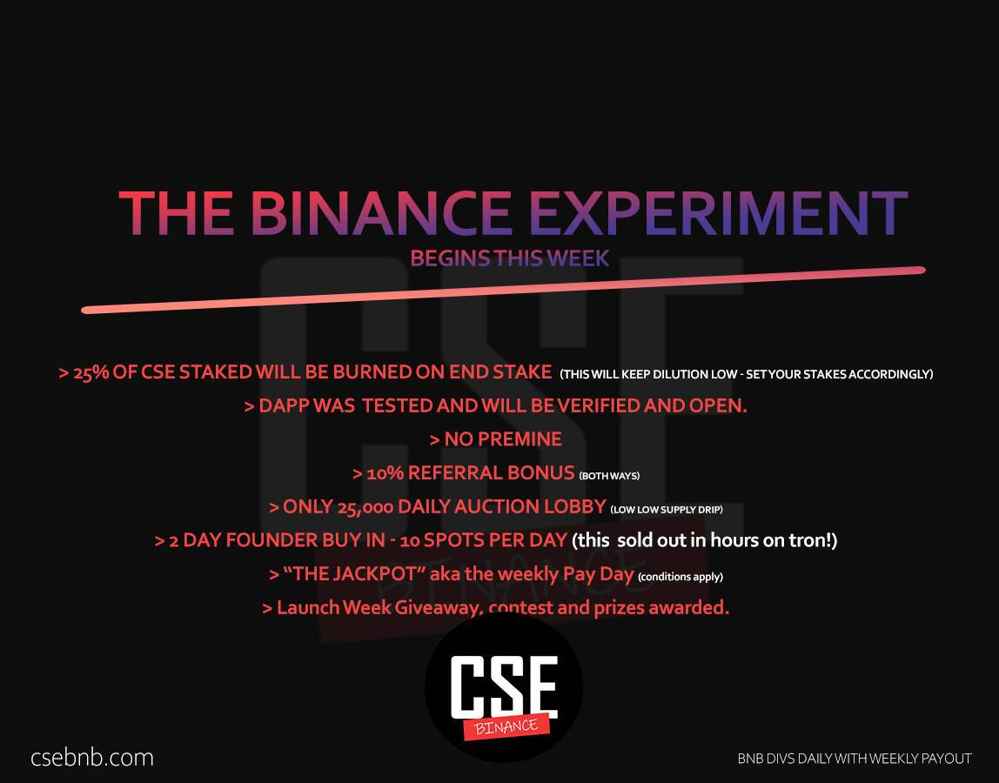

# CSE - Community Staking Experiment

这个想法很简单，作为一个社区，我们想要支付的东西而不是骗局。社区质押实验的存在是为了展示社区在一个伟大平台背后可以做什么的奇迹。

我们的每日拍卖将从每天 250 万个 CSE 代币开始，并将根据购买金额在参与拍卖的用户之间分配。这将在接下来的 365 天内减少。

每天在拍卖大厅花费的前一天 TRX 的 98% 将被汇集并根据用户完成的质押条款分配给用户。

在质押门户中质押您的 CSE 代币并赚取每日利息。此外，Stakers 根据被质押的代币总数的百分比从每日大厅获得 TRX 代币奖励。

