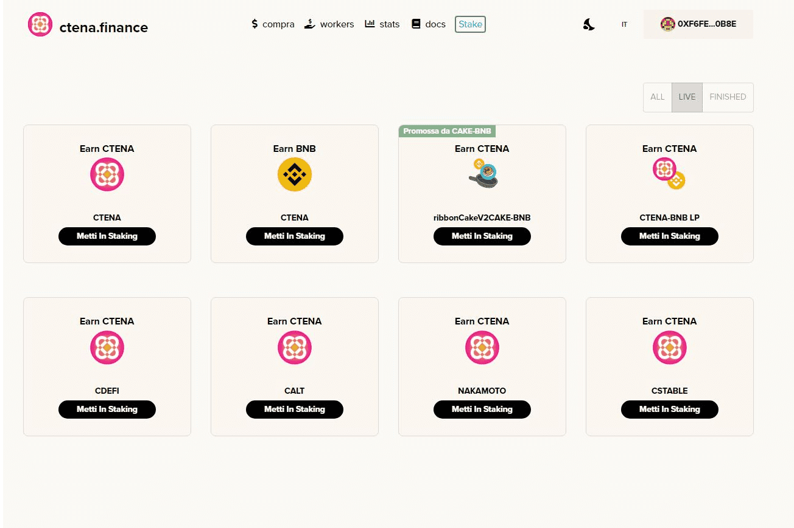

# CTENA Finance

使用新的 CTENA dApp，您可以：I) 购买 CTENA 代币 II) 质押代币 III) 投资我们的 DeFi Vault IV) 投资我们的 CTENA 指数基金 [beta]：
CTENA 是具有自动流动性和燃烧功能的传统代币。通货紧缩，旨在获取价值和管理社区项目。
质押 CTENA 代币和 SAKAMOTO、CDEFI、CALT 和 CSTABLE LP 共享代币，每分钟赚取更多 CTENA 代币。
利用我们的多链收益优化器平台，您可以投资 CAKE、BTCB-BNB LP、ETH-BNB LP、BTCST-BNB LP 等...并赚取更多代币/流动性池份额。

  Catena Nakamoto 指数基金是顶级加密货币（目前为 BTC、ETH、ADA）的优化组合；
  Catena Defi 指数基金是 DeFi 市场上最好的加密货币（目前为 XVS、CREAM、BIFI、CAKE、UNI、DODO、TWT）的优化组合；
  Catena山寨币指数基金是市场上最好的山寨币（目前为XTZ、BAND、LINK、ADA、ETH、EOS、DOT）的优化组合；
  Catena 稳定币指数基金是最佳稳定币（BUSD、DAI、USDT、USDC）的优化组合；
  Catena Protocol DAO Fund 是一个由 DAC 管理的社区基金，您可以输入您的代币提案以纳入或排除在基金中；

农业和公用事业代币（即将推出）。
使用 Ctena Crypto Boy NFT，您可以铸造和管理您的 NFT。

