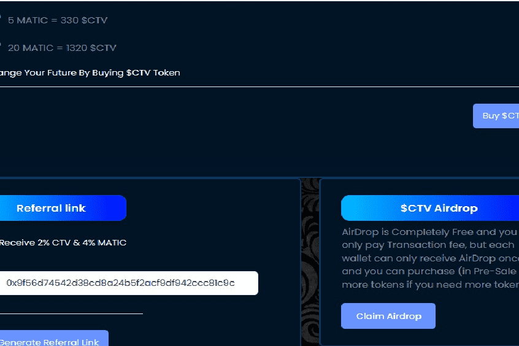

# $CTV Airdrop

Crypto TV (CTV) 是第一个以英语广播的电视网络。将于 2022 年 9 月正式开播。CTV 目前在阿联酋（迪拜）总部拥有强大的员工队伍，包括记者（包括新闻编辑室工作人员、网站、阿联酋办事处、节目和纪录片部分）。该团队帮助 CTV 不仅更快地报道相关国际加密货币新闻，而且更准确。 Crypto TV (CTV) 在 Polygon 平台上推出了一种名为 $CTV 的代币。 $CTV 是加密电视的数字资产。 $CTV 是以社区为中心的；此代币是实用、货币、有价值、资产、奖励和股息代币。当我们设计加密电视时，我们想要 $CTV，它的名义代表是 5,000,000,000，$CTV。考虑到这一点，生成了 $CTV 的数量。 Trust Wallet 和 Metamask 是可以持有 $CTV 的最重要的钱包。 Crypto Television为此代币提供多种金融计划，包括：空投、预售和交易所公开发售。 CTV 未来计划是：CTV 交易所的启动、CTV 媒体的启动、慈善基金的启动、CTV 服务的使用支付。很快就可以进行投资和质押。

