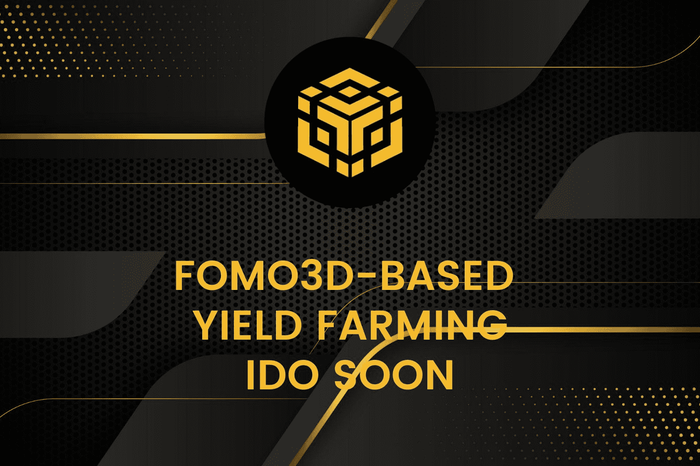

# CubeBSC

· 这是一款博弈论 DeFi 游戏，在游戏结束时最后购买钥匙的人赢得底池！

· 在一个回合中，人们可以购买1个或更多的钥匙，这会增加计时器的时间并将他们标记为当前的领导者。每轮购买一次钥匙，钥匙的价格都会略有上涨。

·玩家从游戏中获得被动收入流，因为在回合中购买了钥匙。这些奖励可以随时提取。

· 玩家还可以推荐好友参与游戏以获得额外奖励。

· 当计时器归零时，最后买钥匙的人获胜！ （所有购买钥匙的玩家也将获得一件！）

仔细想想，随着底池大小的增加，玩家不太可能允许另一位玩家赢得价值数百万美元的 BNB。这反过来又鼓励了不断购买钥匙（相对于最终的底池大小，钥匙将非常便宜，专为游戏的连续性而设计），从而将奖励流向当前的钥匙持有者。

