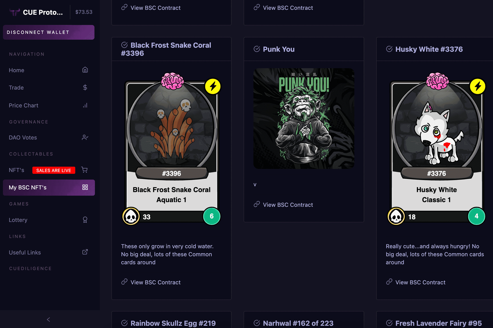

# CUE Protocol

CUE 协议中心是 CUE 协议团队构建的所有 dapp 将出现的地方。
去中心化应用程序包括：
- 社区投票
- NFT 市场
- 适用于所有 BSC NFT 的 NFT 库 - 在一个地方查看所有 BSC NFT
- 彩票游戏
- 预测游戏 - 赢得 CUE 代币
- 质押 - 即将推出
- CUEDiligence - 即将推出
我们的第一个 dapp 现已上线，它是一个投票 dapp，允许所有持有最少 CUE 代币的持有者对治理钱包的支出进行投票。
治理钱包收到每笔交易的 2.5%，所有持有者都使用这个 dapp 对这些代币的使用进行投票。
选项包括销毁、营销、开发和投资其他加密货币。

