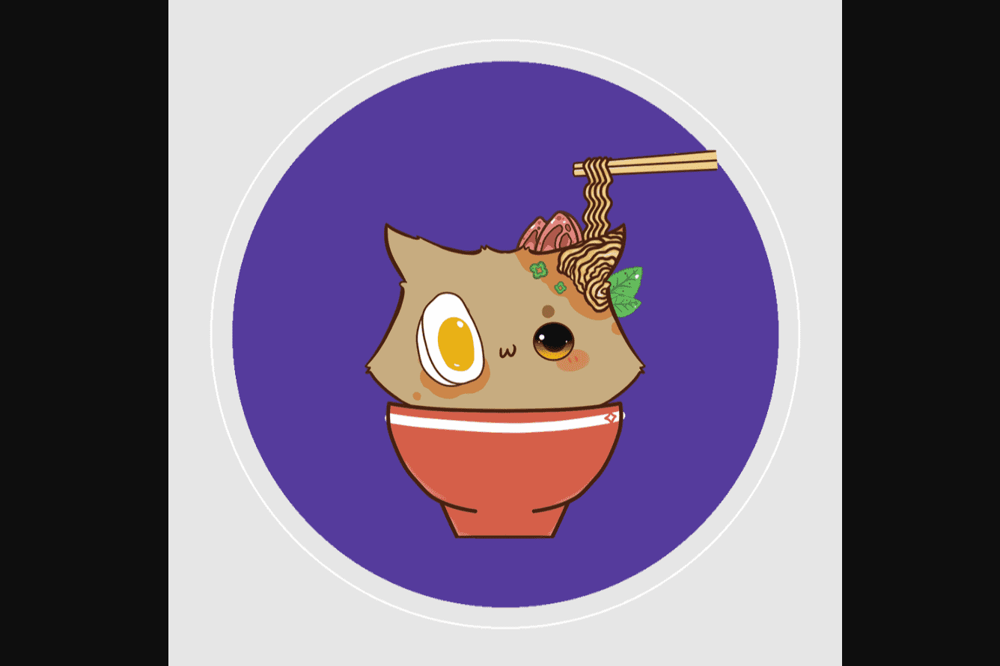

# Cupcats Official

当我和我的男朋友（鲶鱼）谈论我想买一个松饼锅时，我想到了 Cupcats 的想法。我真的很喜欢纸杯蛋糕和松饼，而且我的猫太多了。我不打算创建 NFT 集合，但我学到了很多，因为鲶鱼总是告诉我有关加密和 NFT 空间的故事，我对 NFT 很感兴趣，并想“也许我可以制作一个系列，如果我能创造出一些甜蜜的东西如我所愿，人们可能会喜欢它。”我想挽救我的生命，这是真的，但我从不想通过捐款来做到这一点。我想创造一些有价值的东西，我真的希望人们真的喜欢 Cupcats。感谢 Andre Cronje 的推文，我受到了关注，对此我非常感激。

