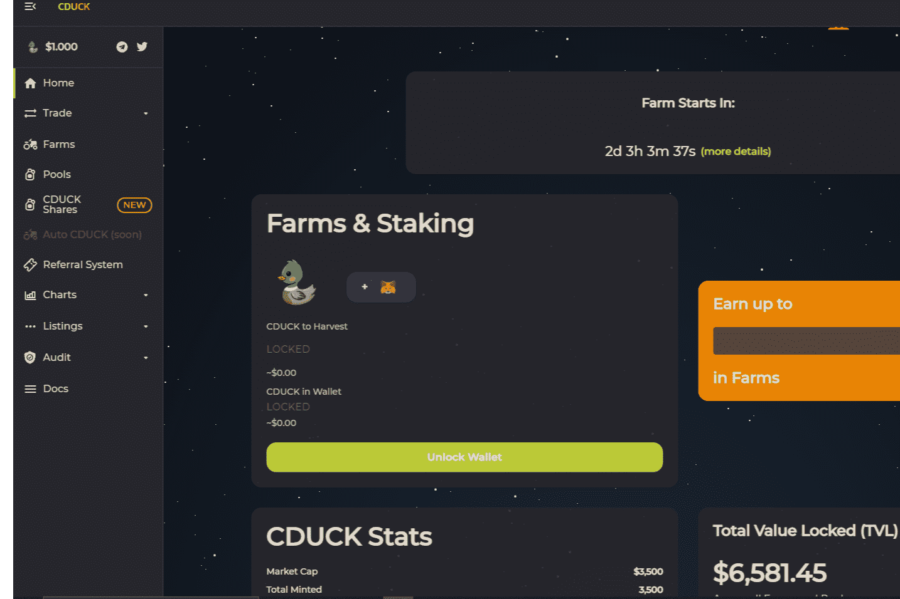

# Cute duck finance

简介 特点
Cute Duck Finance 是一个去中心化的多链农场收益项目，在币安智能链、Polygon（即将推出）和 KuCoin Chain（即将推出）上运行。
CDUCK Finance 将提供这些服务
Yield Farm：通过质押流动性池代币来赚取 CDUCK 代币，我们的平台上有一个独特的功能，称为随机锁定
推荐系统：通过分享链接赚取 CDUCK（您朋友收获的 2%）
CDUCK 股票：质押您的 CDUCK 并赚取 USDC、MATIC、BTC、ETH 等代币。
自动 CDUCK（很快）：自动复合您的 CDUCK 质押，非常棒的功能。
DEX（很快）：当平台达到足够的流动性时，我们将有一个专门的 DEX
桥（很快）：我们将在所有链上实现 CDUCK 之间的桥

