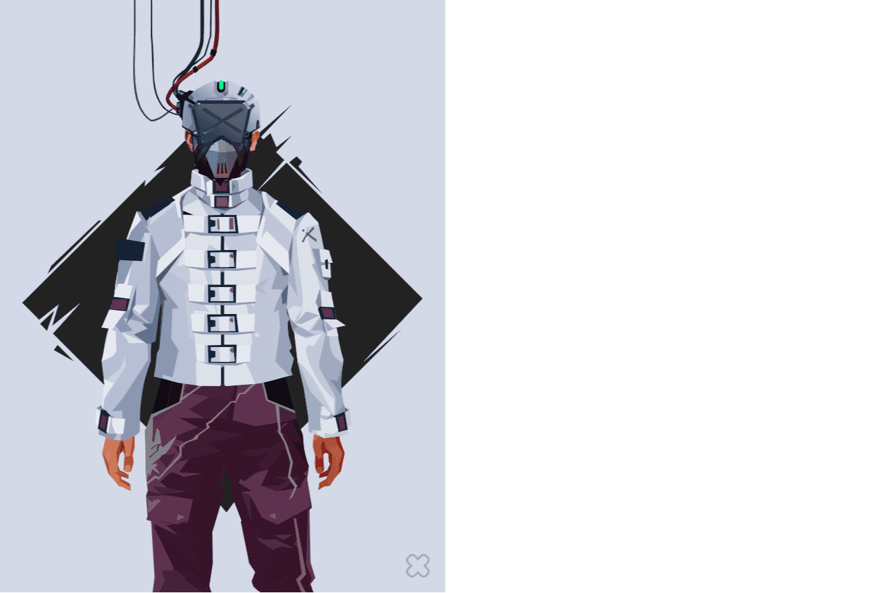

# CyberBrokers

问：Cyber​​brokers 什么时候发布？答：Cyber​​brokers 铸币厂将于 2022 年 3 月 1 日举行 问：我如何获得 Cyber​​brokers？答：以下符合许可名单的条件： - Josie NFT 持有者 - 能够为每个 NFT 铸造 3 个 Cyber​​brokers - Discord 成员 - 在 2 月 4 日 CST 下午 2:22 之前担任“社区成员”角色 - 时事通讯订阅者 - 在 2 之前订阅子堆栈： 2 月 4 日中部标准时间下午 22 点 问：团队在 Cyber​​brokers 上工作了多长时间？ A：团队于 2020 年夏天开始着手 Cyber​​brokers 的开发工作！问：有没有 Cyber​​brokers 的网站 答：Cyber​​brokers.io 问：Cyber​​broker 是否存储在链上？答：是的！ Cyber​​bokers 将完全上链 问：“链上”是什么意思？答：链上意味着实际的艺术品本身是用代码（SVG）制作的，代码存储在智能合约中，任何人都可以提取代码以直接从 ETH 区块链展示艺术品。大多数 NFT 项目只是将图像存储在某个地方（例如 IPFS），如果团队将来停止支持该项目，如果图像出现故障，您的 NFT 可能是空的。借助 Cyber​​brokers，任何人都可以随时读取智能合约代码并恢复艺术品。问：什么是镜像软件？答：Mirrorware 是另一个 Josie 项目，将跟随 Cyber​​brokers - 请继续关注它的更多详细信息。

