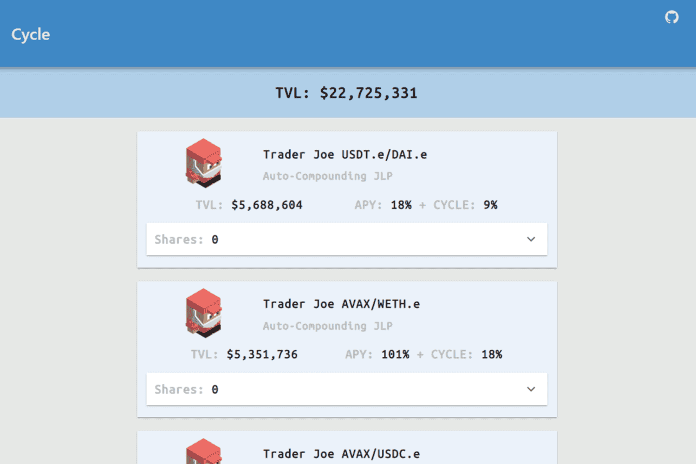

# Cycle Finance

Cycle Protocol 是一个收益优化器，允许您从 Avalanche C 链的各种 DEX/项目中自动组合奖励，并附有它自己的流动性挖掘程序。

我们还有一个独特的 ZAP 功能，允许用户存入（或提取）AVAX 并立即开始自动复利，同时赚取我们的代币。

Cycle 代币将用于治理，以便在协议的健康和发展方面赋予社区权力。质押代币可以让您从协议产生的收入中分得一杯羹。

这些用于回购代币，然后分发给持有者。

