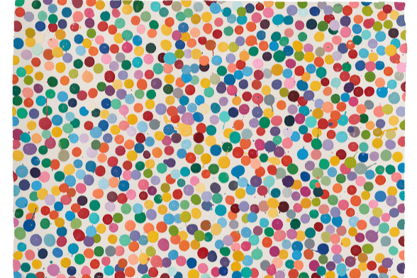

# Damien Hirst - The Currency

HENI 很高兴推出 Damien Hirst 的首个 NFT 系列 The Currency。 The Currency 重新构想了 NFT 的使用方式，是 10,000 个 NFT 的集合，对应于存储在英国安全保险库中的 10,000 件独特的实物艺术品。这些作品现在通过在区块链上发布而变得栩栩如生。

The Currency 从 2016 年的实体艺术品创作开始，探索艺术与货币的边界——艺术何时改变并成为货币，以及货币何时成为艺术。成功的申请者最初都会收到 NFT。最终，您必须在数字 NFT 或实体艺术品之间做出选择，这两者本身就是艺术品。无论你选择哪个，另一个都会被烧毁。

该系列位于 Palm 区块链上，这是一个新的代币驱动生态系统，用于连接到以太坊的 NFT。它的能源效率比以太坊或比特币等工作证明系统高 99%。货币 NFT 可以转移到以太坊。

