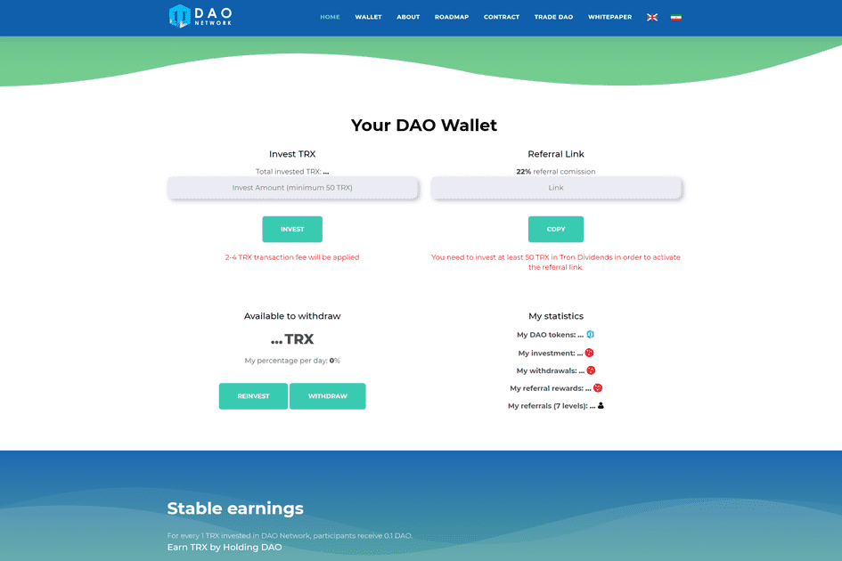

# DAO NETWORK

🌟TRX 投资强大的平台🌟
DAO Network 是一个通用的质押平台和服务提供商。 🌍
每天 14-20% 🏆
22% 推荐奖励🏆

去中心化自治组织 (DAO)
没有集中领导的成员拥有的社区。
与互联网陌生人合作的安全方式。
为特定事业投入资金的安全场所。

DAO（程式化 Đ）是一个数字去中心化自治组织 [5] 和一种以投资者为导向的风险投资基金。 [6]在 2016 年 4 月通过代币销售启动后，它成为历史上最大的众筹活动之一。 

DAO 的目标是为组织商业和非营利企业提供一种新的去中心化商业模式。[7][8]它在以太坊区块链上实例化，没有传统的管理结构或董事会。 [7] DAO 的代码是开源的。 

Christoph Jentzsch 于 2022 年 7 月 22 日在德国慕尼黑的 1E9 和德意志博物馆参加未来节 (Festival der Zukunft)。
2016 年 6 月，用户利用 The DAO 代码中的漏洞将 The DAO 三分之一的资金转移到一个附属账户。以太坊社区有争议地决定对以太坊区块链进行硬分叉，以将大约所有资金恢复到原始合约。这将以太坊区块链分成两个分支，每个分支都有自己的加密货币，其中原始的未分叉区块链继续作为以太坊经典。 

