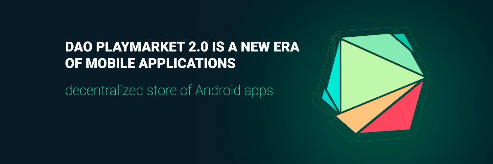

# DAO Playmarket 2.0

DAO PlayMarket 2.0 是一个去中心化的 Android 应用商店，结合了 STO 开发者平台加密货币交易所，接受加密货币支付。 DAO PlayMarket 2.0 的主要目标和目的是为开发者、投资者和用户创建一个可持续的经济模型，并为移动应用市场的代币化引入统一的标准。 DAO PlayMarket 2.0 相对于其他平台的优势： • 允许安卓应用程序发行自己的代币并在内置的 STO 平台上实现它们； • 平台抗审查——主要信息存储在区块链中，允许您从世界任何地方访问应用程序； • DAO PlayMarket 2.0 平台集成了一个去中心化的加密货币交易所，其中包括一个开放的 API； • 付费应用程序和应用程序内购买将通过加密货币支付。 DAO PlayMarket 2.0 代币的代码 - PMT 代币标准 - ERC20。总供应量 - PMT 的 3 000 000 名持有者自动成为 PlayMarket 基金的成员。该基金的主要目的包括与 DAO PlayMarket 2.0 的其他成员一起开放管理基金的资源。 DAO PlayMarket 2.0 上的应用程序开发人员可以为其应用程序发布独立的代币。 PlayMarket Fund 从托管在 DAO PlayMarket 2.0 平台上的每个应用程序中保留 5% 的代币。

