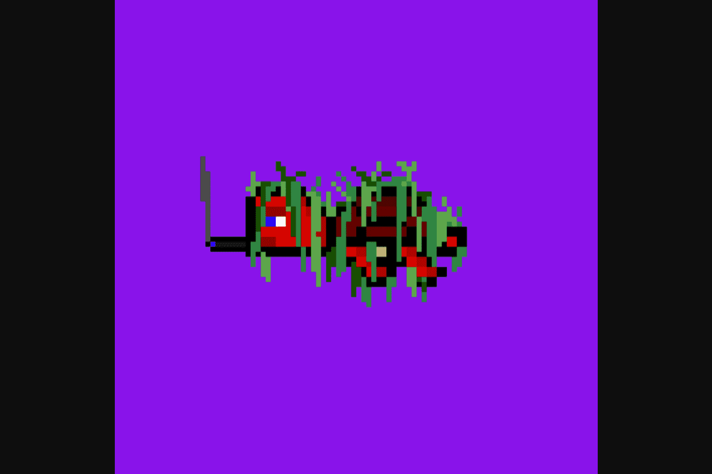

# DAO Turtles

DAO Turtles 将使用一种名为 $Turtleshells 的代币实施的治理模型来运行。拥有此代币的个人能够影响治理提案投票，参与私人 DAO 对话和要求按比例分享 DAO 收益。

一个分散的自治组织，专注于拯救海龟并为持有者带来价值。

我们对这个项目未来的计划是为我们的持有者开发一款酷炫但简单的游戏。目前，该游戏处于早期开发阶段。由于我们这边的一些错误，开发的开始非常缓慢。首先，我们尝试与我们的内部开发人员一起开发游戏，他们在游戏开发方面没有太多经验。之后，我们开始寻找游戏开发团队，但花费的时间比预期的要长。我们最初的想法是创建一个简单的赛车游戏，让海龟可以相互竞争。我们的生态系统代币将被纳入游戏。

我们将在第二季度末进行社区投票，届时我们将展示我们提出的多个模板，持有者将能够表达他们的偏好。预期的游戏发布时间将在 2022 年第三季度或第四季度左右，但是，这些日期可能会发生变化，因为游戏开发非常复杂，并且不可预见的错误可能会阻碍我们的进展。

