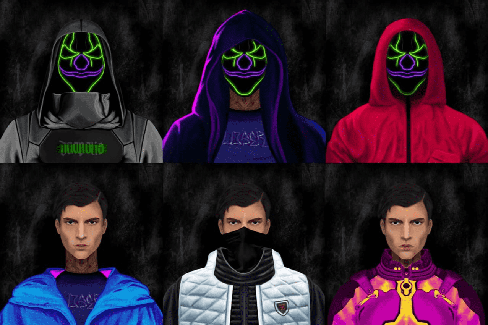

# Daopolis NFT Collection

自动生成 9192 个 NFT。 Daopolis 公民诞生于 CyberTime 时代，将成为 Celo 上新游戏元世界的基础。找到您的数字化身，进入私人俱乐部并参与独特的 NFT 游戏！
道波利斯是一座未来之城，它被分为两个阵营，争夺势力范围。每个派系都捍卫自己的领土并试图夺取其他派系。
Daopolis NFT 公民将分为 3 种类型：

- 机器人
- 匿名的
- 电子人

认识道波利斯市民
自动生成 9192 个 NFT。 Daopolis 公民诞生于 CyberTime 时代，将成为 Celo 上新游戏元世界的基础。找到您的数字化身，进入私人俱乐部并参与独特的 NFT 游戏！

