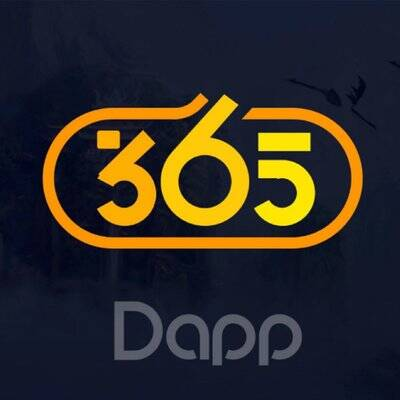

# Dapp365

公平、刺激、好玩的dapp游戏平台

Dapp365 是一个赌博 dApp。它基于 TRON 区块链。您可以赌博您的 TRX 硬币，并有机会赢取奖品。 Dapp365 声称自己是一个公平且无需信任的游戏提供商。这意味着，该平台是完全去中心化的。

Dapp365 dApp 是基于 Tron 协议构建的赌博类别的加密资产。现在，根据用户数量，它在一般 dApp 排名中排名第 2010 位，在赌博类别中排名第 249 位，这让您可以很好地了解 Dapp365 dApp 在其竞争对手中的表现。

通过分析最近 30 天窗口中的 Dapp365 dApp 数据，可以看出 dApp 的 Balance 为 0.00 美元，Volume 稳定在 0.00 美元。 Dapp365 在 30 天内产生了 0 笔交易，变化为 0%。显然，与之前的 7 天期间相比，交易量稳定了 0%。最近 7 天的数据显示，Dapp365 用户基数为 0，稳定了 0%。

我们还建议查看 Dapp365 活动概览和智能合约平衡图表，了解这些重要指标如何随时间波动和变化。

