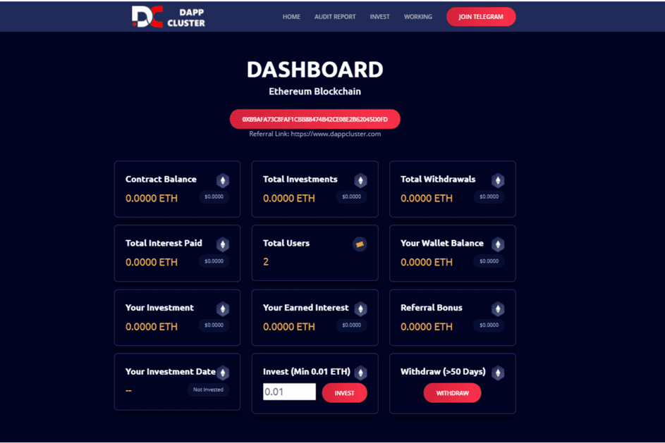

# DAPPCLUSTER

DApp集群
DAppCluster 是一个基于以太坊区块链的自动复合智能合约。该平台已被编码为优先考虑高级别的安全性和安全性。 DAppCluster 是由重视通过智能合约技术进行的长期和可持续的股息支付机会的聪明人创建的——没有中介
DAppCluster 现在在以太坊区块链上运行。
主要特征

  一个长期和可持续的去中心化生态系统
  源代码验证智能合约
  由多名审计师审计
  建立在以太坊区块链上
  保护合约流失免受鲸鱼攻击的内置机制
  被动收入来源
  防诈骗，无后门和退出诈骗代码
  开源代码
  由行业领先专家和大型加密社区提供支持
  投资者可以投资低至 0.01 ETH。
  硬锁定和软锁定周期不会让系统资金耗尽并长期保持系统运行。
  开发费用、营销费用或任何推荐金额不会从用户的原始投资中扣除。在软锁定期间也会产生同样的结果，减轻投资者的负担。

