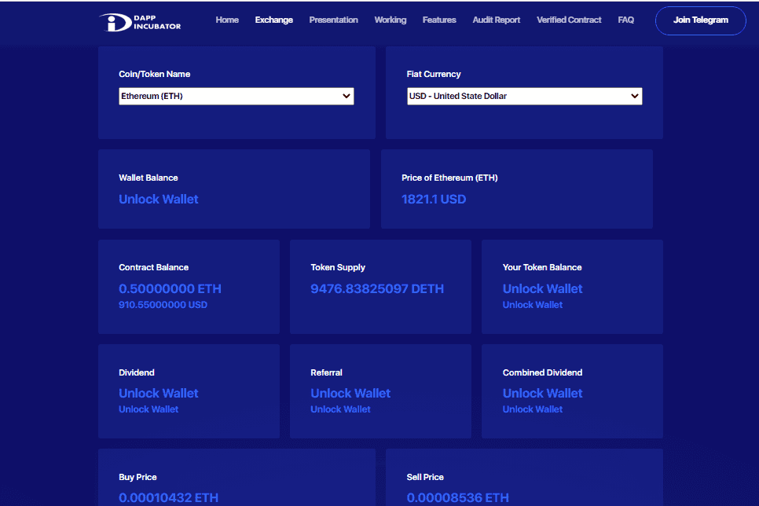

# DAppIncubator

DAppIncubator 是部署在以太坊区块链上的自主去中心化交换智能合约，通过提供高投资回报，提供了一种产生被动收入的安全方式。
DAppIncubator 智能合约实时管理所有区块链交易，无需任何第三方干预。这些交易包括购买代币、出售代币、提款、再投资、分配股息和定义代币的价格等
DAppIncubator 以多种方式为用户创造收入，包括增加投资资产价值、增加购买的代币价格、获得代币持有的股息等。
以太坊和 ERC-20 代币资产是 DAppIncubator 系统的重要组成部分。用户需要使用网站或通过区块链调用投资功能将以太坊或 ERC-20 代币投资（发送）到 DAppIncubator 智能合约。通过发送以太坊和 ERC-20 代币，智能合约将铸造 Dagainst 投资。对于以太坊，系统将为 USDT 铸造 DETH。系统将铸造 DUSDT。每个铸造代币的价格是根据预定义的初始价格和增量价格确定的，这将在下一张幻灯片中讨论。

