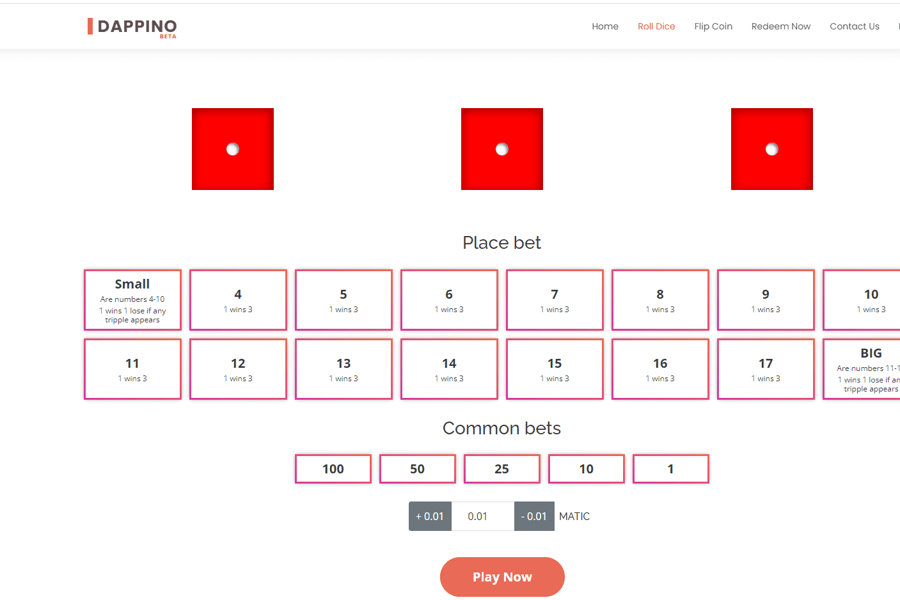

# Dappino

Dappino 是在 Binance 和 Polygon 区块链上作为分布式应用程序 (DAPP) 运行的一组游戏。
掷骰子
翻转硬币
为这些游戏提供动力的智能合约已经过验证，可以从以上页面查看。
Dappino 使用 ChainLink VRF 生成随机数，确保游戏公平。
测试和现场模式都可用，这样您就可以在不花真钱的情况下尝试游戏。

Dappino 是一套在流行的以太坊、币安和多边形区块链上运行的去中心化游戏
Dappino 由一组智能合约运行，确保代码透明且可验证。这是你怎么玩的

 安装 MetaMask 钱包并添加您的帐户
 选择您选择的网络（以太坊/币安/多边形）
 下注，然后批准交易
 这会提示智能合约代码运行，并让您知道您是否赢了
Dappino 努力成为一个 100% 透明的系统，让用户玩公平的游戏。

 Dappino 让您以低至 0.02 ETH / 0.02 BNB / 0.01 MATIC 的价格玩游戏
 Dappino 只有 1% 的房屋优势（以太坊最低 0.015 ETH，Binance 最低 0.015 BNB，0.003 MATIC）
 Dappino 让您立即提取余额。

