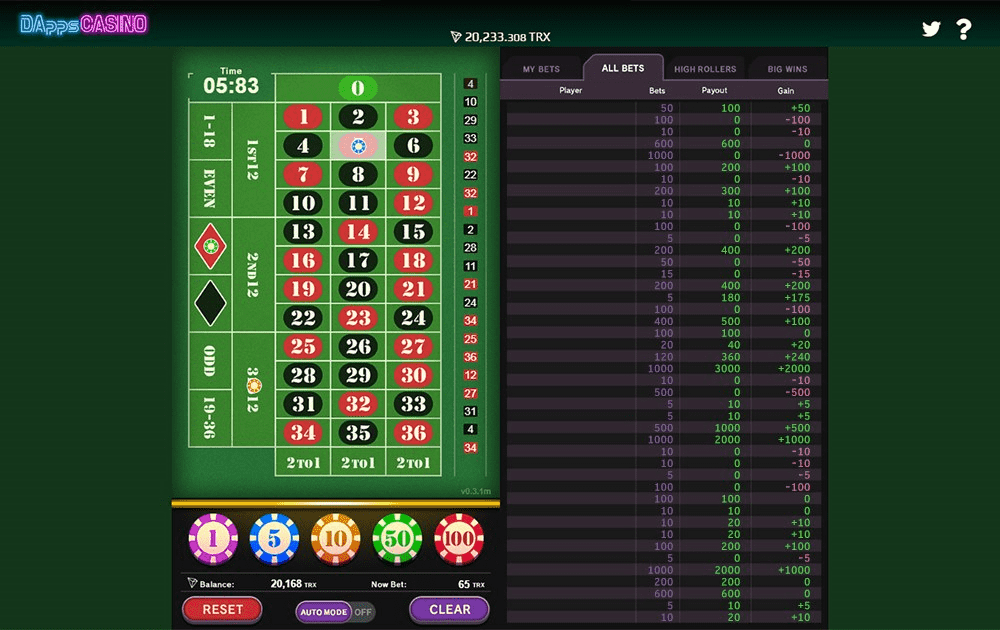

# DappRoulette

DappRoulette DAPP技术分析
DappRoulette dApp 是一种基于该协议的赌博类别的加密资产。现在，根据用户数量，它在一般 dApp 排名中排名第 270 位，在赌博类别中排名第 1827 位，这让您可以很好地了解 DappRoulette dApp 在其竞争对手中的表现。

通过分析最近 30 天窗口中的 DappRoulette dApp 数据，很明显 dApp 的余额为 86.53 美元，交易量看涨，为 0.00 美元。 DappRoulette 产生了 0 笔交易，在 30 天内下降了 0%。显然，与之前的 7 天期间相比，交易量下降了 0%。最近 7 天的数据显示，DappRoulette 用户基数为 0，并且一直在增长 0%。

我们还建议查看 DappRoulette 活动概览和智能合约余额图表，了解这些重要指标如何随时间波动和变化。

