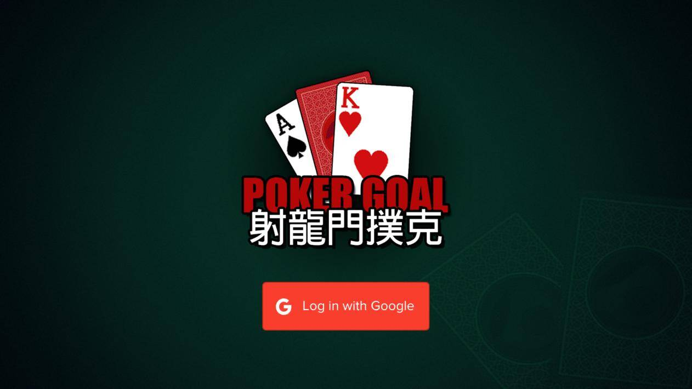

# DargonGatePoker - 射龙门扑克

灵感来自经典的龙门射击扑克游戏，添加可选的龙门牌，剩余牌数，获胜概率等。创新玩法让游戏简单而刺激。灵感来源于经典射龙门扑克游戏，任选龙门牌、剩余牌数、赢奖游戏加入等，让创新玩法简单又刺激。

EOS区块链是一个由去加密货币的去加密货币支持的去中心化平台，并支持中心应用程序。计算资源在EOS加密货币持有者之间的平均分配）来像Google的Play商店和Apple的App商店一样工作。

EOS支持合约，并采用智能分配方式，通过灵活分配的自治公司来来工业规模的分割式应用。

EOS 取消了交易费用，可进行多笔交易，并采用数字化应用程序实现数字化身份和扩展性的区块链链。以及多个 CPU 内核和通信/或集群的应用程序调度。

