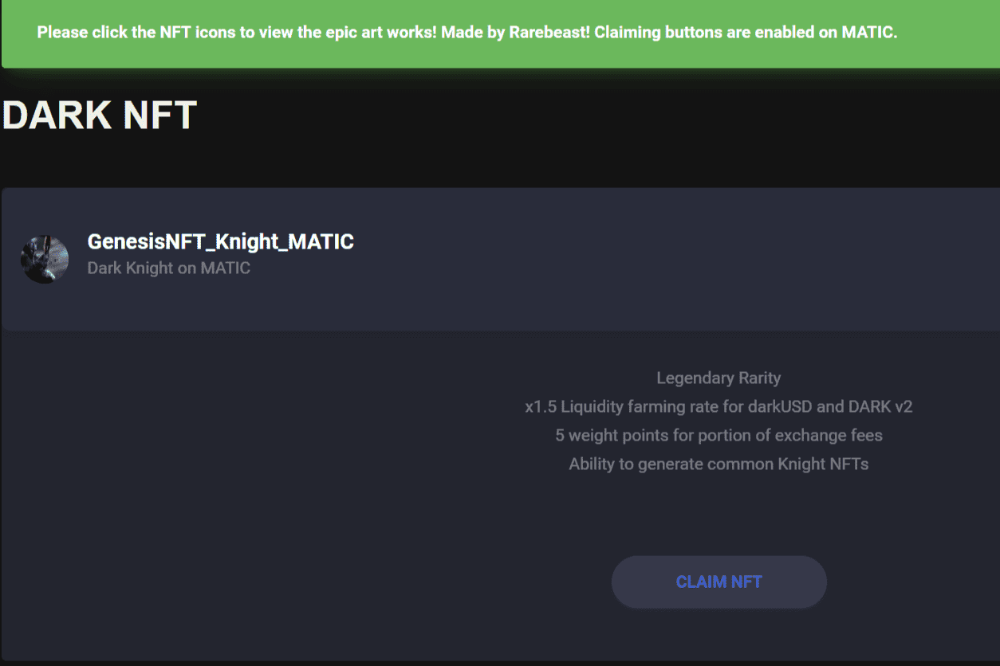

# DarkBuild

传统的质押涉及将代币存入合约并在一段时间后接收另一个代币。通过 DARK 质押，我们最初将同时奖励 6 个代币给 DARK 质押者：

  DARK（可转换 1:1 到 DARK）
  sDARK（暗生态系统支持的稳定币）
  darkDAI (Dark Wrapped DAI, 相当于 1 DAI via unwrapping)
  MATIC（将实施 L2 ETH 网络、DEX 和 Staking）
  Storj（用于 IPFS 内容存储，未来产品）
  ENJ（用于未来的 DARK NFT 游戏）

自动无气
在这一点上，您可能会担心提取/索取多个奖励的 gas 成本。不必担心这一点，因为我们设计的质押奖励每天都会自动空投到您的质押地址。这将如何实现？通过我们的一项黑暗特工 (aDARK) 工作。奖励将每天发送给您，只要您被质押，您就不会花费任何气体。

