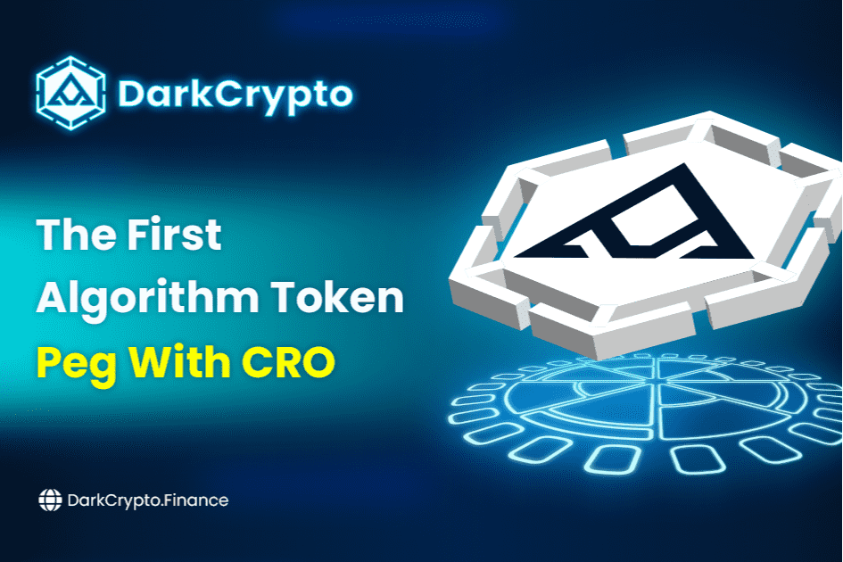

# DarkCrypto Finance

DarkCrypto 协议是第一个与 CRO 挂钩的算法令牌，能够生成在 Cronos 网络上运行的 DARK 令牌。

它涉及一种创新的解决方案，可以确定性地调整稳定币的供应量，使稳定币的价格朝着目标价格的方向移动，从而为 DeFi 带来可编程性和互操作性。

主要问题是如何增加对 DARK 代币的需求。 DarkVerse 将是我们使用 DARK 作为主要代币的围绕 DarkCrypto Finance 的生态系统。 DarkVerse 包含：DeFi 应用程序（Vaults）、GameFi、NFT 应用程序、投注 DApps、MetaVerse 应用程序。我们将有无穷无尽的工作，我们可以一起让 Cronos 成为最大的区块链。

