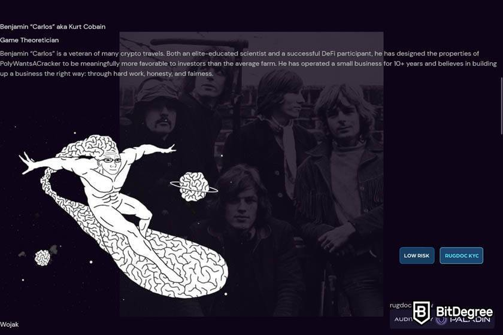

# Darkside Finance

Darkside Finance 是唯一真正由用户拥有的收益农场。所有矿池和农场都会产生两个代币！ CZDIAMOND 是一种所有权代币，质押者获得所有存款费用的 75% 和所有其他平台收入的 50% 作为 USDC 分红。 DARK 代币价格支持获得 25% 的存款费用和 50% 的其他平台收入。 Darkside Finance 是 Sugandese Tokens 收益农业系统中的第 3 层。其他层是 PolyWantsACracker 和 Stadium Arcadium。在这一层，平台增加了链上 OTC 引擎、老虎机和更多赌博游戏，以及用于间接回购的 Lootbox 合约。

