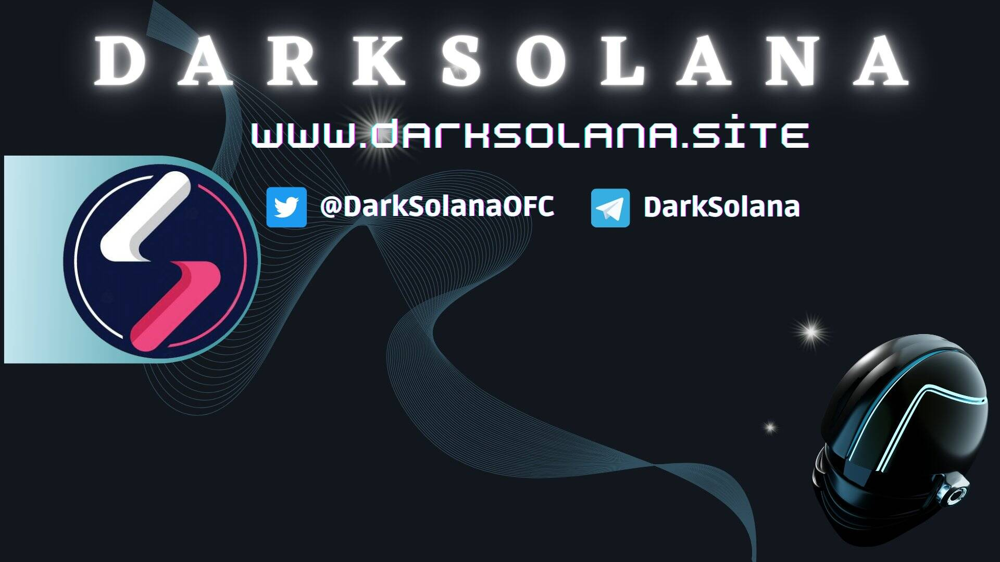

# DarkSolana

DarkSolana 是一种去中心化衍生品原语，用于构建在币安区块链上的基于风险的应用程序。通过一系列原生协议，DarkSolana 为衍生品合约（期货和期权）和派利互惠合约的强大、功能齐全的去中心化交易所提供框架和基础设施。
网络价值来自协议内产生的交易费用。 100% 的交易费用由质押的 DarkSolana 代币持有者、专业节点运营商、活跃参与者、网络金库和对网络生态系统和功能至关重要的开发人员池分摊。
✅ 限量供应 35 亿
✅ 每次推荐 100% DARKSOL 红利
✅ 代币每 $DARKSOL 上架 $0.005
🔄 贷款重组
⭐️ 即时资金
⚡️ 衍生协议

