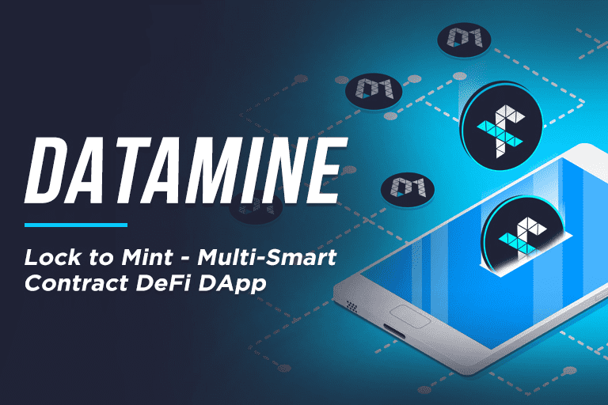

# Datamine

Datamine Network 是一个新的非托管和去中心化开源经济系统，它使用智能合约来创建自适应货币。我们的双代币 DeFi 协议每 15 秒产生一次红利。

由燃烧证明支持的加密货币
Datamine FLUX 是 DeFi 的第一个基于以太坊的抗通胀货币。市场均衡是使用燃烧证明算法的变体建立的。

我们的代币经济学：燃烧证明如何在 L1 上运行
通过在智能合约中锁定 Datamine (DAM) 来启动您的 FLUX 验证器
您的验证人每 15 秒生成一次 FLUX（在 Uniswap 上交易）
从流通中燃烧 FLUX 可提高您的铸币速度（获得奖励快 30 倍）
燃烧 FLUX 创造了流经 1% Uniswap 池的货币速度

