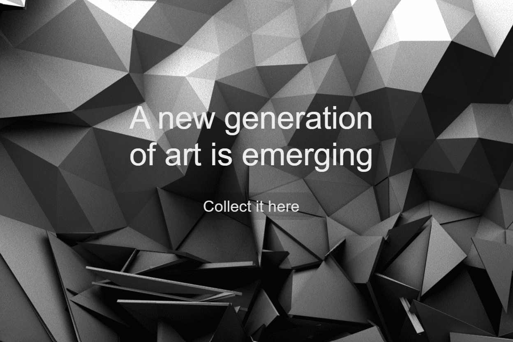

# daVinci NFT Marketplace

daVinci 市场是一个 NFT 市场，支持创建、购买和销售在 Harmony 区块链上铸造的 NFT（不可替代代币）。这意味着，与使用 ETH 的 Rarible 或 OpenSea 相比，Harmony 原生代币 ONE 推动了 daVinci 平台上的所有交易。 Harmony ONE 与基于 ETH 的平台的优势：在 Harmony 上铸造的 NFT 成本低于 0.01 美元 - 0.001ONE，采用 EPoS（有效股权证明）共识算法，所需能源消耗比 PoW 少 99%。以太坊的情况正好相反，大约 50-100 美元。对于使用 PoW（Proof-of-Work）共识算法的交易，需要大量的计算能力。气候活动家拥有红色标记的 ETH，特别是为了为维持区块链的数据中心提供动力，他们花费了大量的精力。在 daVinci 中，新人的入门门槛要低得多，给了每个人创造 NFT 的可能性，我们可以称之为环境的“绿色”♻️。在 Harmony 区块链上，每个区块每 2 秒签名一次。时间，所以在达芬奇平台上的交易作为用户体验就像使用签证一样。 Harmony 与其他加密区块链的比较。

