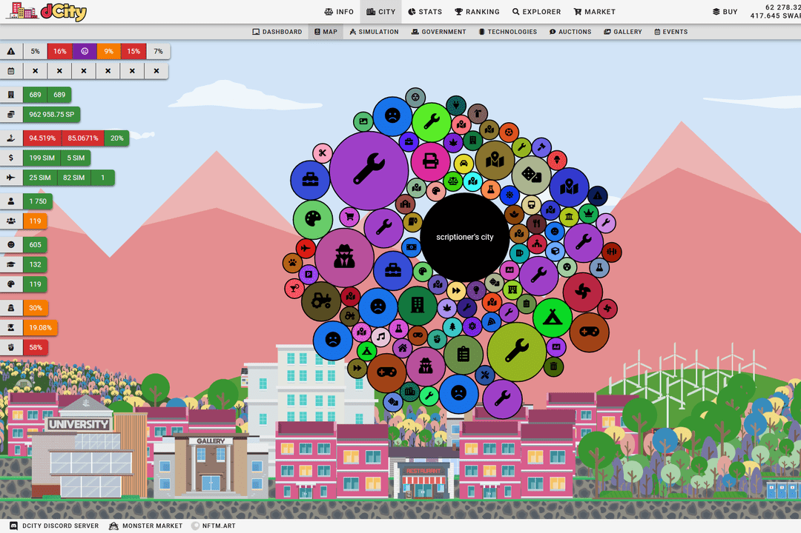

# dCity

Dcity 是一款基于 Hive-Engine 上可用的不可替代代币的数学和交易游戏。玩家使用代表建筑物、公民、技术的代币建造自己的城市，并以蜂巢（基于排名）和 SIM 治理代币（基于城市收入）的形式赚取收入。还有一些卡片是玩家只能通过玩游戏才能获得的，例如技术、背景和预防卡片。dCity 是一款基于 Hive-Engine Non-Fungible Tokens 的城市模拟器游戏。 NFT 代表游戏中的资产。每张单独的卡片都是建筑物、公民等，而您卡片的总集合就是您的城市。 dCity 允许玩家在建筑、人口和收入方面优化他们的城市。

