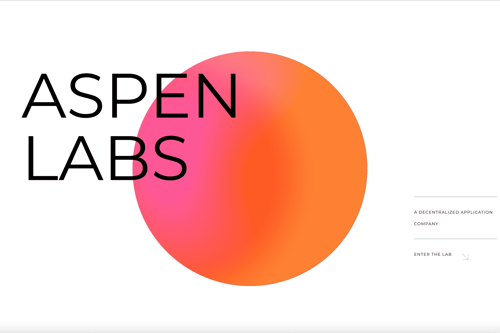

# dCOLLECT

Aspen 是一家去中心化的应用程序开发公司。我们在当前的开源协议之上构建层，以使用户能够更高程度地访问金融选项。
目前，Aspen 的重点是在三年内推出相互构建的应用程序。从名为 dCOLLECT 的 NFT（不可替代代币）的 dAPP 开始。
紧随其后的是我们称为 Hypersphere 的 De-FI 产品。在与计算机科学家 Samuel Buss 博士交谈后，我们发展了一个 4 维数学概念。该应用程序将允许对用户的数字资产和非托管利息收入进行通用插值。
我们的期望是开发进一步的应用程序，允许通过低利率的链上交互进行社会融资，称为 dLEND。这将允许全球获得用于用户教育或房屋所有权的低息资本。
我们的第一个 dAPP，dCOLLECT 是一个零费用的 NFT 标记平台，将允许交易我们的历史 NFT，并将扩展到包括其他艺术家数字创作的现场拍卖。

