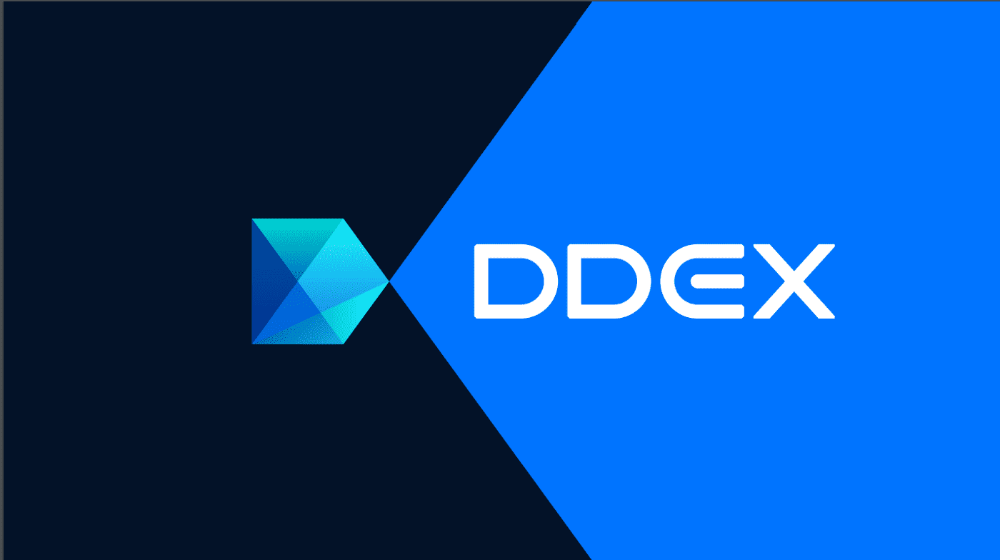

# DDEX

DDEX 是第一个基于 Hydro Protocol 技术的去中心化交易所，提供即时、实时的订单匹配和安全的链上结算DDEX 是一种去中心化的加密货币交易所。我对这笔交易进行了大量研究，但没有太多可用信息。 DDEX 是一个全球性的交易所，几乎可以在地球上的每个国家使用。这是一个很好的功能，因为它有助于交易所更快地扩展。

互联网和移动应用程序均可用于访问交易所。 DDEX 也是最人性化的交易所之一。 DDEX 之所以能够获得客户的信任，是因为其广泛而强大的安全系统。因为它是一个安全的交易所，注册过程简单，对黑客的抵抗力很高。

