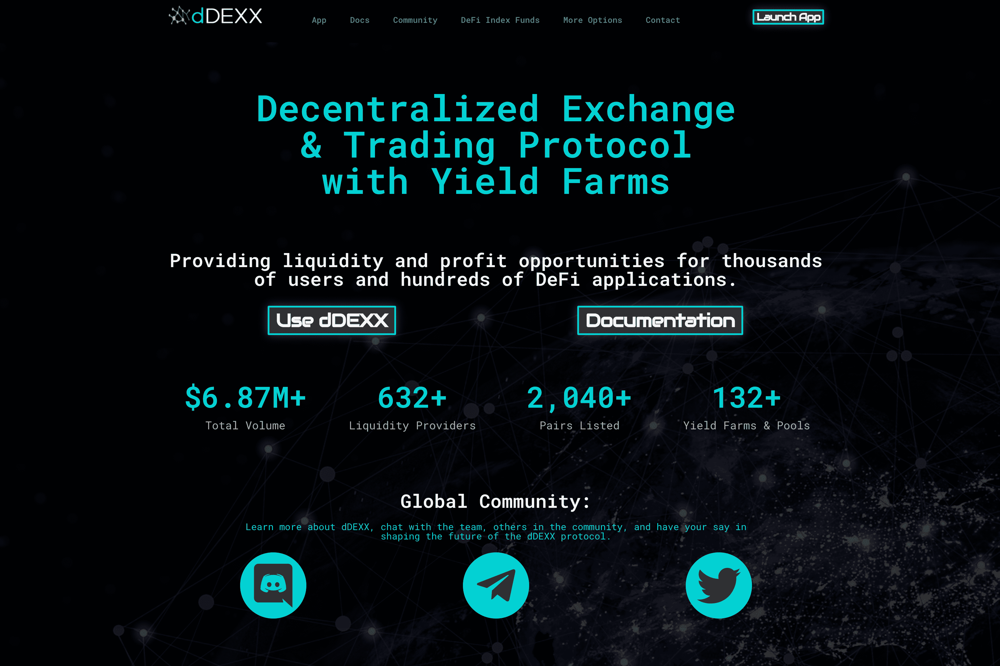

# dDEXX

dDEXX 是一个基于自动做市商 (AMM) 的去中心化交易所 (DEX)，拥有可盈利的 DeFi Yield Farms、矿池等。" dDEXX 是一个基于自动做市商 (AMM) 的去中心化交易所 (DEX)，它是 dVest 生态系统的一部分。dDEXX 建立在币安智能链 (BSC) 网络之上，具有简单快捷的交易功能、可盈利的流动资金池、和高 APR 收益农场，用户可以在其中赚取 dDEXX 代币、交易所交易费用等等。”

