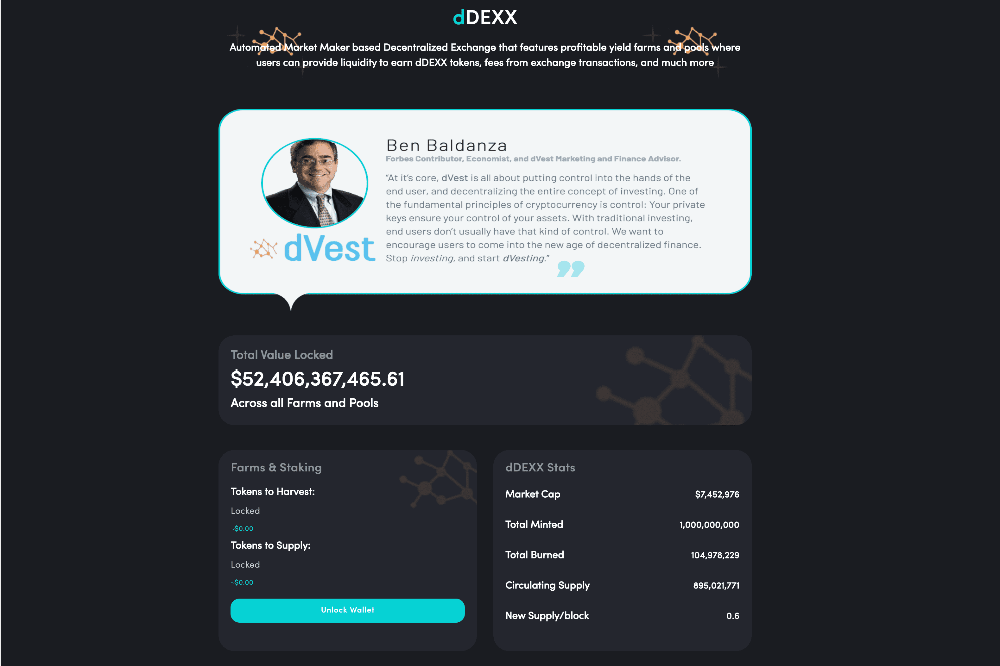

# ddos

如果你调用合约的 gettoken 方法，同时它也会发送它持有的所有 DDOS 代币的 0.01%。从格林威治标准时间 2019 年 11 月 1 日上午 8 点开始，它还将每秒铸造 25 个新的 DDOS 令牌。 2.5个DDOS将发送到团队帐户，22.5个DDOS将用于空投。这将持续大约 15 个月，届时将存在 10 亿个 DDOS，其中 9 亿个免费提供给社区。我们将在未来几年继续在各种项目上构建和添加实用程序并为 DDOS 代币增值，敬请期待。 Token合约源码：&nbsp;

