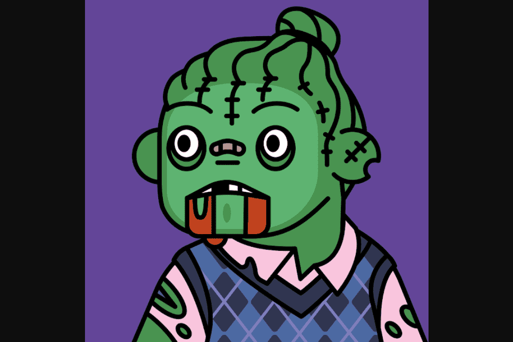

# DeadFellaz

用你的 DeadFellaz 代币来艺术、文化和社区
我们在这里是为了对艺术的热爱以及游戏化、IP 和 NFT 技术的发展。
我们的工作重点是在 NFT 空间内进行创新，并以创造性的方式赋予我们的持有者权力。DeadFellaz 是 2021 年 8 月推出的基於以太坊的 10,000 個 NFT (ERC-721) 集合。聯合創始人是創意製作機構的聯合總監 Betty 和該系列的首席藝術家 Psych。 Maddy Kenyon 是該項目的 3D 首席藝術家。

該集合具有 300 多個隨機生成的特徵和屬性，包括嘴巴、眼睛、頭部和身體等級。

該項目的受歡迎程度很大程度上源於團隊的活動和對雄心勃勃的里程碑的追求，以及各種名人 DeadFellaz 的持有者。

