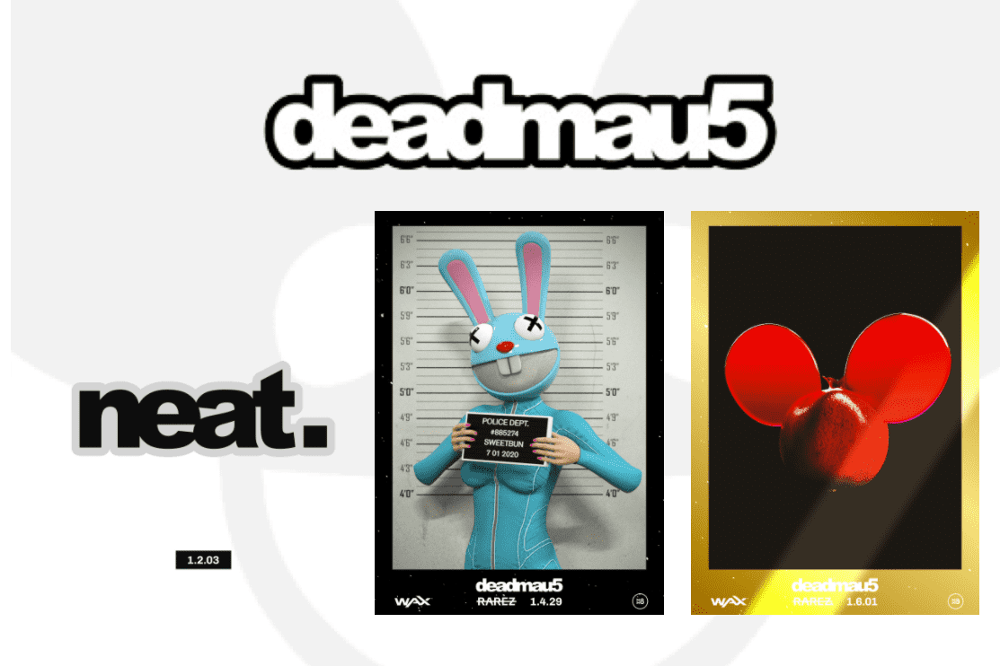

# Deadmau5 NFTs

快到 2021 年了，音乐正在走向虚拟化。 Deadmau5 自己的“项目 oberhalsi”即将推出。数字节目意味着数字商品，对吗？您可能无法触摸它，但这些基于区块链的收藏品在您购买后是可以交易的。这使您能够在市场上购买、出售和交换它们，以帮助完成您的套装或找到您想要的作品。
最初，这些包装与随机选择的收藏品一起出售，你不知道你会得到什么。
这些数字作品被称为 NFT，每一件都是完全独一无二的（带有铸币厂编号）并经过认证。 NFT 有六种不同的稀有度，有些甚至可能在 Oberhalsi 内部具有特殊的权力。

