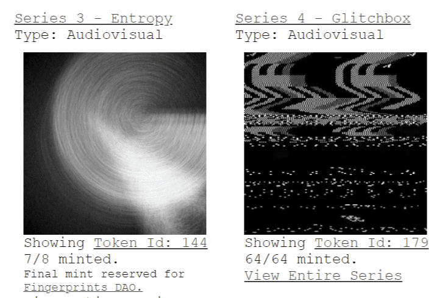

# Deafbeef V2

DEAFBEEF 在 2020 年 COVID 19 大流行开始时开始了一个艺术项目。当我的孩子们还小的时候，我在岩石下生活了 7 年之后，我发现模块化合成器已经重新流行起来。拥有电气工程、录音和音乐方面的背景，我对合成器文化重新出现感到兴奋。然而，在新文化中存在一定程度的消费主义，我决定采取另一种苦行的方式，用“无”来制作音乐，而不是将时间和金钱投入到许多人认为是神奇的“黑色”的昂贵硬件上盒”。我也不想升级我使用了 10 年的笔记本电脑来运行最新的 DAW。我选择从头开始重建，只使用一台运行 Linux、emacs 文本编辑器和 C 编译器的廉价笔记本电脑。其目的是在基本层面上工作，将数字直接写入数字存储媒体，然后被解释为声音和图像。

