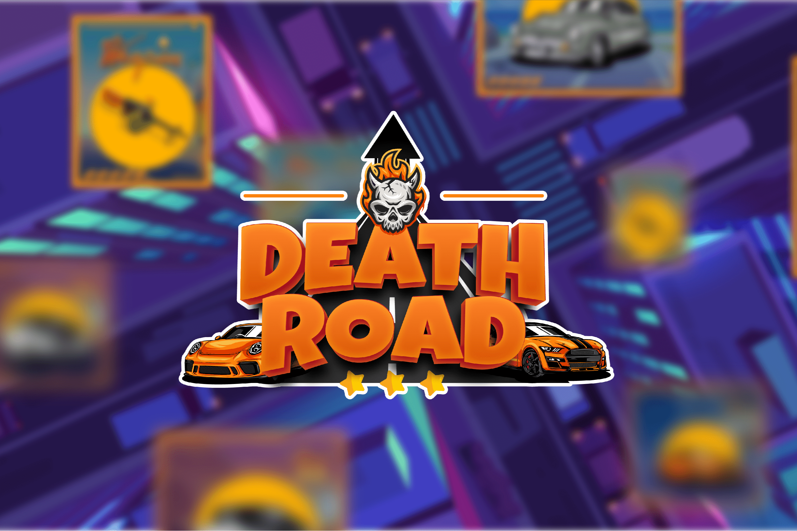

# DeathRoad

欢迎来到死亡之路，这是 BSC 上的第一款虚拟世界赛车游戏，这是一个为下一代赛车手打造的综合游戏生态系统。
DeathRoad 是一个面向元宇宙的微型城市。这是一个玩家可以根据自己的想法自由创建和建造城市的天堂，一个可以提供玩家需要的所有功能的地方，例如财产，出租汽车，车库等。此外，在死亡之路城市中，玩家还可以加入其他游戏区域来赚取利润，例如“战斗模式”——玩家可以使用独特的功能——“竞速赚钱”来赚取更多利润；或“市场”，他们可以与其他玩家进行交易。
尤其是“Race to Earn”活动获得的代币可以帮助玩家拥有更多的新赛车。只有拥有超过 5 辆汽车的玩家才能解锁游戏中的所有实用程序和功能。
将买卖房地产集成到死亡之路中，这可能是一个非常突出的点，因为游戏中的地块数量有限，并且玩家需要拥有土地才能打开车库或汽车租赁等其他服务。玩家还可以买卖这些房产以产生额外收入。
Deathroad 发展成为 BSC 生态系统中的第一款虚拟世界赛车游戏。我们已经完成了游戏的测试版，并处于路线图的第 2 阶段。不久，官方产品将介绍给社区。并且肯定会得到我们现有社区的积极回应。

