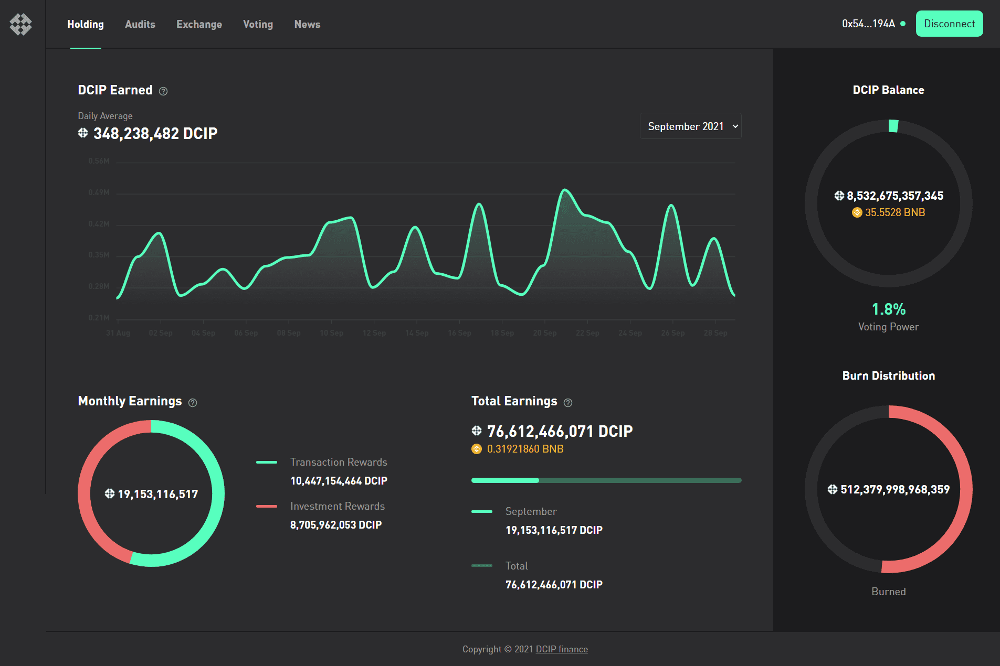

# Decentralized Community Investment Protocol

DCIP
去中心化社区投资协议 (DCIP) 是 BEP20 币安智能链网络上的第一个投资即服务 (IaaS) 和完全去中心化的投资基金代币，与同一网络上的竞争对手代币不同，DCIP 拥有真实世界的用例，使其独一无二——这些真实用例也不限于 BEP20 网络，它们受益于不断扩大的区块链机会。
DCIP的特点简而言之，值得强调的主要特点如下：

  第一个在 BEP20 BSC 网络上提供完全去中心化投资基金的 IaaS。
  社区对去中心化投资决策的投票。
  以 BNB 或 BUSD 形式的投资回报，作为代币持有者的被动收入。
  持有后24小时内销售的惩罚性税收，以及遏制负面影响的反鲸措施。

除了作为其各自网络上的第一个 IaaS 代币外，DCIP 的平台还将在其智能合约中提供独特的完全去中心化投票选项，将去中心化投资的概念概念化，使该代币与众不同。
通过智能合约中的内置投票，这确保了有关 DCIP 投资的所有决策都是社区主导的决策。此外，DCIP 的投资范围不仅限于加密货币投资——例如，社区可以选择投资房地产——提供现实世界的投资。个人的 DCIP 代币余额直接代表他们在投票权和利润中的份额，投资的利润或回报将以 BNB 或 BUSD 支付。

