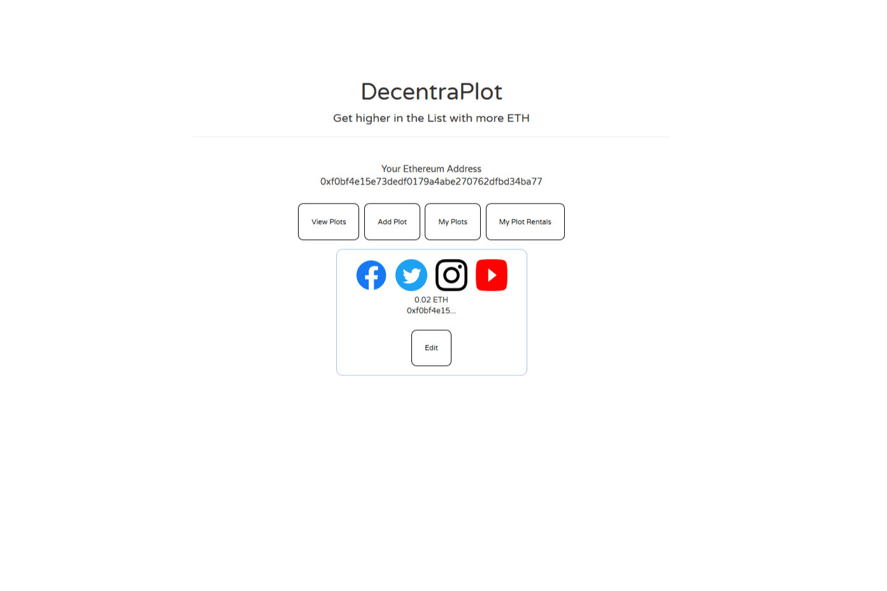

# DecentraPlot

创建一个您拥有自己的个人资料的情节，您可以在其中宣传您的社交媒体。 ETH 越多，您的地块在列表中的位置就越高。您可以将您的地块出租给其他可以获得 ETH 的人。

DecentraPlot DAPP 技术分析
DecentraPlot dApp 是基于该协议的社交类别的加密资产。现在，根据用户数量，它在一般 dApp 排名中排名第 1080 位，在赌博类别中排名第 486 位，这让您可以很好地了解 DecentraPlot dApp 在其竞争对手中的表现。

通过分析最近 30 天窗口中的 DecentraPlot dApp 数据，很明显 dApp 的余额为 0.00 美元，而交易量看涨，为 0.00 美元。 DecentraPlot 产生了 1 笔交易，在 30 天内下降了 -50%。显然，与之前的 7 天期间相比，交易量下降了 0%。最近 7 天的数据显示，DecentraPlot 用户群为 1 并且一直在增长 -100%。

我们还建议查看 DecentraPlot 活动概览和智能合约平衡图表，了解这些重要指标如何随时间波动和变化。

