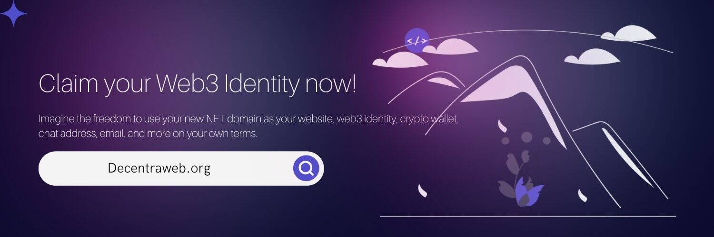

# DecentraWeb

DecentraWeb 是以太坊区块链上 DNS 基础层协议的去中心化实现，允许用户无需许可地将顶级域 (TLD) 注册为 NFT。

DWEB 价格实时数据
今天的 DecentraWeb 实时价格为 0.188289 美元，24 小时交易量为 3,294.51 美元。我们将 DWEB 实时更新为美元价格。 DecentraWeb 在过去 24 小时内下跌了 2.28%。当前的 CoinMarketCap 排名为 #1650，实时市值为 632,127 美元。它有 3,357,220 枚 DWEB 代币的流通供应量，最高可达 3,357,220 枚。供应 100,000,000 DWEB 代币。

如果您想知道在哪里以当前价格购买 DecentraWeb，目前交易 DecentraWeb 股票的顶级加密货币交易所是 MEXC。您可以在我们的加密交换页面上找到其他列表。

DecentraWeb 是以太坊区块链上 DNS 基础层协议的去中心化实现。

DecentraWeb 旨在通过允许任何人以许可方式创建自己的顶级域 (TLD) 并作为 NFT ERC-721 在以太坊区块链上永久拥有它，从而改变互联网和 DNS（域名系统）。

