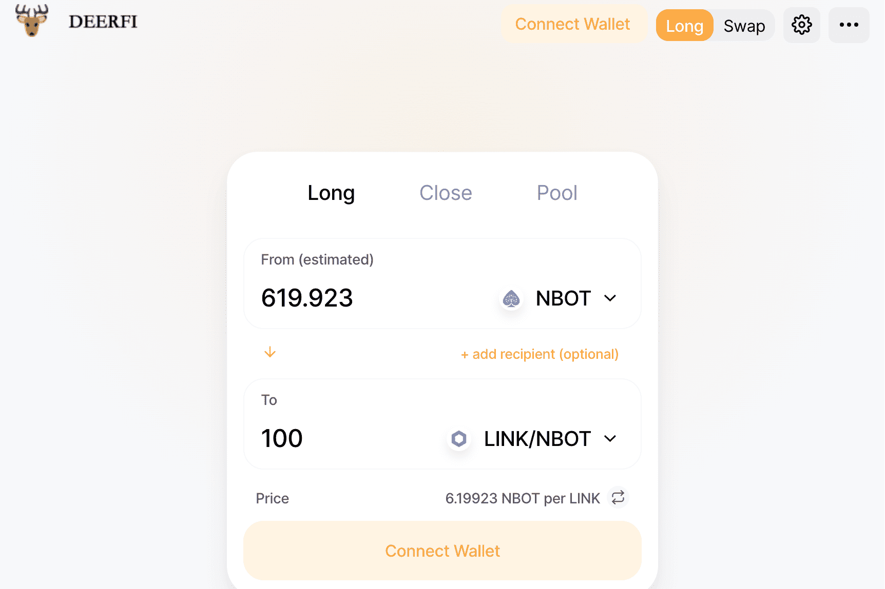

# Deerfi

Deerfi 提供了一个新的 DEFI 乐高积木来支持 LP 代币持有者，用户现在可以在其中存入 Uniswap 流动性提供者 (LP) 代币作为 Deerfi 贷款的抵押品。例如，用户可以将 USDC-USDT Uniswap LP 代币存入 Deerfi，作为借入更多 USDC 和 USDT 为 Uniswap 提供额外流动性的手段。只要 Uniswap 的流动性收益率高于 Deerfi 的借款利息，用户就可以获得比以往更多的收益。 Deerfi Lending 协议旨在帮助 Uniswap 生态系统和其他 DEFI 平台以完全去信任和去中心化的方式创建繁荣的货币市场。

