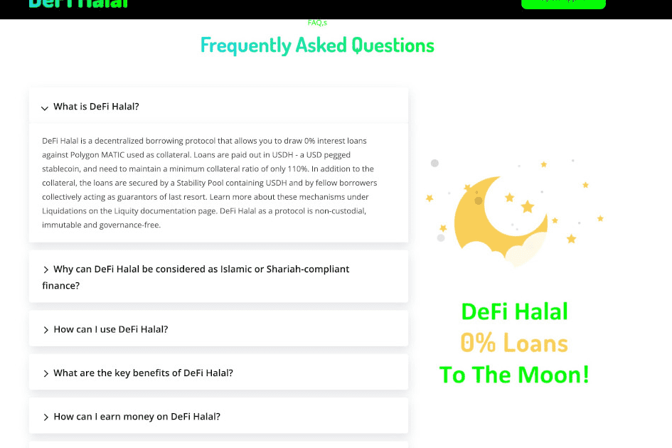

# DeFi Halal

得益于部署在 Polygon 上的 DeFi 清真协议，现在可以无需任何利息即可获得符合清真和伊斯兰教法的贷款。它基于 Liquity 开源的经过实战测试和审计的合约。所有合约代码都是开放的，可以在部署在 Polygon 区块链上的经过验证的合约中进行检查，不可变且不受任何人控制！
- 110% 的最低抵押率 DeFi Halal 的高效清算机制让用户能够为其 MATIC 获得最大的流动性。 *在正常操作下。 - 0% 利率 DeFi Halal 向借入 USDH 收取少量一次性费用，而不是高度可变的利率。 - 1 USDH ≈ 1 USD 借入 USDH，一种与美元挂钩的有支持的稳定币，由算法货币政策维持
- 费用低 一次性清算费用仅为 1 美元，比 Liquity 协议低 200 倍 - 最低贷款额仅为 9 美元 最低贷款额比 Liquity 协议低 200 倍 - 赎回费用低 与 Liquity 协议相比，赎回费用低
为什么 DeFi Halal 可以被视为符合伊斯兰或伊斯兰教法的金融？
伊斯兰银行业务符合伊斯兰教法的原则。一个关键因素是它没有利息或 riba 运作，这在伊斯兰教中是不允许的，因为金钱本身不被认为是可以从中获利的商品。伊斯兰银行业务是资产支持的，DeFi Halal 就是这种情况，因为 MATIC 提供融资作为支持贷款的资产。
