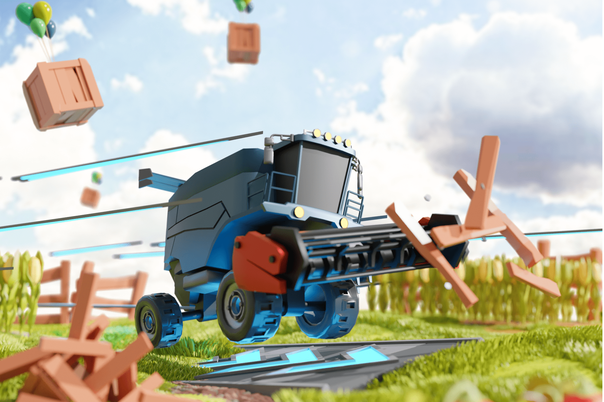

# DeFi Land

DeFi Land 是一款独特的多链农业模拟游戏，旨在游戏化去中心化金融的各个方面。该游戏的主要目标是让个人更轻松、更简单地参与到令人兴奋的 DeFi 和加密世界中，同时也有机会获得乐趣。
DeFi Land 将提供传统平台提供的所有功能，但一切都将集中在一个地方。该游戏为玩家提供了免费开始游戏的机会，逐步提升到玩 2 赚取级别（或直接购买），与其他玩家竞争，制作，交易，并以有趣和令人兴奋的方式做所有其他事情.
本机实用程序令牌称为 DFL，可用于：

  交易游戏内资产和 NFT；
  Staking 和 LP 激励措施
  治理投票，让玩家有机会决定如何分配网络资源。

DeFi Land 引入的 play-2-earn 模式允许用户通过完成任务或达到某些里程碑来赚取收入。该游戏适合每个人 - 无论您是在寻找悠闲而有趣的东西，还是活跃而令人兴奋的东西，您都可以在 DeFi Land 上找到它。

