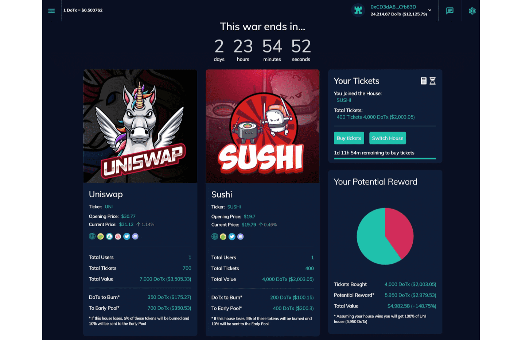

# DeFi of Thrones

DeFi Of Thrones（DoTx）旨在通过跟踪和收集来自 DeFi 生态系统的价格数据并为用户提供赌博的可能性，成为预测市场平台。每周都会有 2 个 DeFi 代币或硬币进行战争。一个选择你的“房子”的机会，意思是你认为表现最好的代币/硬币。在一周结束时，投注表现最好的硬币的玩家将获得 DoTx 奖励。我们致力于通过游戏化功能将预测市场提升到一个新的水平。我们计划在 3 项主要技术上构建平台：使用 DApp 技术部署以太坊 ERC-20 代币、基于 ChainLink 协议预言机和应用程序编程接口 (API)，以确保 DoTx 项目具有高度的可信任性、透明度和去中心化。

