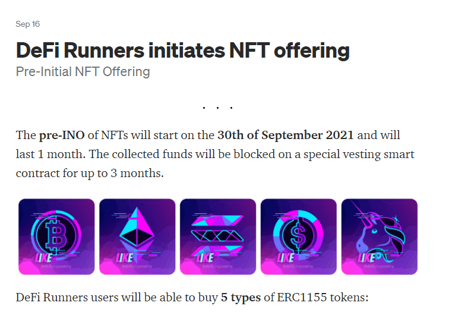

# DeFi Runners

DeFi Runners 是一个为加密资产用户提供各种服务的金融项目。 DeFi Runners 的想法是将所有现有的金融工具转移到一个平台中，为交易者和投资者提供复杂的解决方案。该平台有利于中小型企业实现狭隘的解决方案。区块链：BSC、POLYGON。
NFT 拍卖将发布一组经典拍卖，通过 Panopticon 服务和出色的 NFT 收藏，将给加密艺术爱好者和数字艺术家带来惊喜。Marketplace 将提供加密资产和商品的销售。请记住，Defi Runners 将使用 ERC 20/721/1155 代币（cashback eNFT）并且能够出售真实代币（cashback rNFT）。交易肯定是 Defi Runners 允许市场交易的最重要工具之一（明确掉期）、限价交易和杠杆交易。对于交易，将使用 UniswapV2/V3 等第三方 AMM 流动性。指数交易将类似于在 ERC20 代币上发布的经典股票市场指数（道琼斯、纳斯达克、标准普尔 500 等）。 Defi Runners 将根据加密货币类型创建一组索引，从而为价格提供者建立一个预言机系统。首先，将发布新的部门defi指数，第二阶段我们的用户将受益于1：1与股票市场的行动。赏金服务将在一年中的每个季度交付空投代币，并为市场和拍卖用户发放现金返还在 NFT 代币中。

