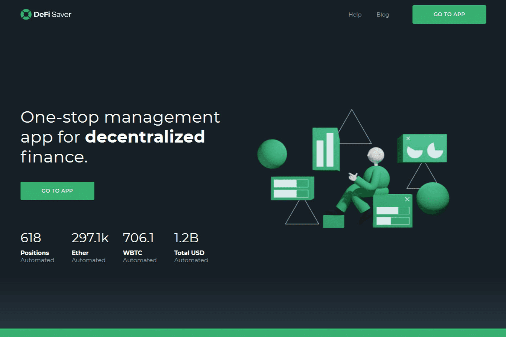

# DeFi Saver

DeFi Saver 是一款用于去中心化金融协议的高级管理应用程序，专注于创建、管理和跟踪杠杆头寸，具有独特的自动化资产管理和清算保护功能。
DeFi Saver 提供广泛的功能，如投资组合管理、借贷、资产交换、贷款再融资和构建自定义交易，支持 MakerDAO、Compound、Aave、Reflexer、dYdX、Uniswap、Kyber、Curve、Balancer 和其他流行的协议和去中心化交易所。
资产管理应用程序目前与 MetaMask、Ledger、Trezor、Fortmatic、Coinbase Wallet、Trust Wallet 和 WalletConnect 等钱包兼容。
DeFi Saver 的一些核心功能包括：

  Boost & Repay：允许用户在单一、无缝的交易中轻松增加头寸规模或减少债务。
  自动化：设置自动清算保护或以特定价格和比率增加杠杆。
  智能储蓄：快速获得跨 DeFi 协议的最佳贷款利率。
  Loan Shifter：再融资工具，提供一种即时简单的方式来更改抵押品或债务资产以及在协议之间转移。
  自定义交易构建器：将闪电贷款、资产交换和其他 DeFi 协议交互等多项操作组合到单个交易中。
  模拟模式：通过创建单独的测试环境，允许用户在不支付任何费用或花费任何资金的情况下试验和测试 DeFi Saver 的所有功能。

