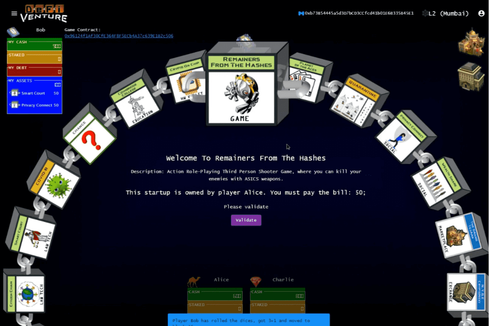

# DeFi-Venture

游戏规则简介：
一个去中心化的棋盘游戏，向所有人介绍 dApp、区块链和 DeFi。受垄断但面向加密货币的启发，游戏逻辑和加密经济机制完全由运行在区块链上的智能合约执行
由于玩游戏可能是学习新事物的最佳方式，因此这款游戏的目的是让每个人（尤其是不熟悉区块链、dapps 和 DeFi 的人——我们最关心的是我们的亲密朋友和家人）玩游戏并从中获得乐趣这些新概念，以便更好地了解它是什么以及去中心化解决方案与传统解决方案有何不同，特别是在 DeFi 中。
记住经典的大富翁游戏如何让我们了解货币、银行、贷款、投资、资本主义的基础知识。
DeFi-Venture 重塑了垄断游戏，使概念和机制适应区块链生态系统中出现的概念和机制。
作为玩家，您扮演加密企业家的角色，您的目标是通过在加密领域创建和发展业务，成为最富有的玩家。

